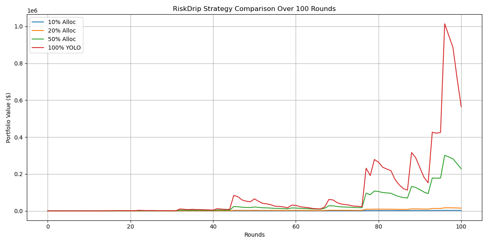

# Coming Soon

RiskDrip™ is an open-source collection of risk monitoring scripts.

Both mock data and actual data are used, with the aim of improving ML risk mitigation accuracy.

Check back later as more working scripts are added to this repository.

